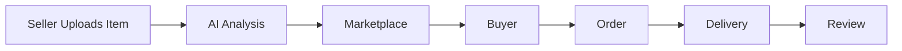
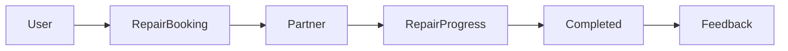
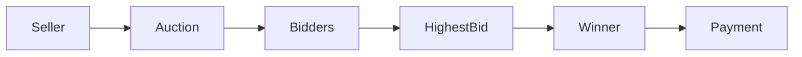
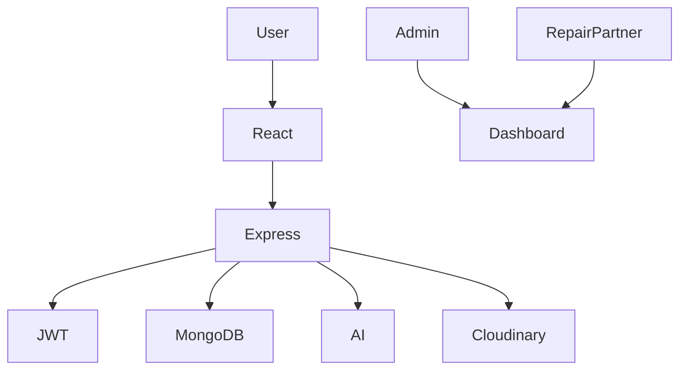

<div align="center">

# 👕 ReThread

### ♻️ AI-Powered Sustainable Fashion Resale & Repair Marketplace


### 🌱 Buy • Sell • Repair • Reuse • Reduce Waste

---

### 💚 Helping Build a Sustainable Fashion Future

</div>

---

# 📖 About ReThread

ReThread is an **AI-powered sustainable fashion marketplace** where users can buy, sell, repair, and auction pre-owned clothing.

Instead of throwing clothes away, users can extend the life of garments while reducing textile waste and tracking their positive environmental impact.

---

# 🎥 Demo

> Add your project demo video or GIF here.


---

# ✨ Core Feature

| Feature | Description |
|----------|-------------|
| 🔐 JWT Authentication | Secure Login & Signup |
| 👕 Marketplace | Buy & Sell Clothes |
| ❤️ Wishlist | Save favorite products |
| 🛒 Shopping Cart | Easy Checkout Flow |
| 🤖 AI Grading | Clothing Condition Analysis |
| 🏷 Authenticity Score | AI-generated authenticity report |
| 🔨 Repair Booking | Book Clothing Repairs |
| 💬 Messaging | Buyer & Seller Chat |
| ⭐ Reviews | Product Ratings |
| 🏆 Auctions | Live Bidding System |
| 📊 Sustainability Dashboard | Water & CO₂ Savings |
| 👨‍💼 Admin Panel | Complete Platform Management |

---

# 🌍 Sustainability Impact

ReThread tracks environmental impact generated by reusing clothes.

### Users can see

✅ Water Saved

✅ CO₂ Emissions Reduced

✅ Waste Diverted

✅ Sustainability Score

Example Dashboard

```
♻ Sustainability Score

Water Saved
1200 Litres

CO₂ Reduced
18.5 kg

Clothes Reused
12

Repair Orders
5
```

---

# 🤖 AI Features

✔ Clothing Condition Detection

✔ AI Damage Analysis

✔ Authenticity Score

✔ Smart Recommendations

Example Report

```
Condition : Excellent

Authenticity : 95%

Suggested Price :
₹1450

Recommended Repair :
No Repair Needed
```

---

# 🛒 Marketplace Flow



---

# 🔨 Repair Service Flow



---

# 🏆 Auction Flow



---

# 🏗 System Architecture



---

# 📁 Folder Structure

```
ReThread
│
├── backend
│   ├── config
│   ├── controllers
│   ├── middleware
│   ├── models
│   ├── routes
│   ├── utils
│   └── server.js
│
└── frontend
    ├── api
    ├── assets
    ├── components
    ├── context
    ├── hooks
    ├── layouts
    ├── pages
    ├── routes
    ├── services
    └── App.jsx
```

---

# ⚙ Tech Stack

## Frontend

- React 19
- Vite
- Tailwind CSS
- Axios
- React Router

---

## Backend

- Node.js
- Express.js
- JWT
- bcrypt
- Multer

---

## Database

- MongoDB
- Mongoose

---

## AI

- Image Processing
- Condition Analysis
- Sustainability Scoring

---

# 🚀 Installation

## Clone Repository

```bash
git clone https://github.com/yourusername/ReThread.git
```

---

## Backend

```bash
cd backend

npm install

npm run seed:admin

npm run dev
```

---

## Frontend

```bash
cd frontend

npm install

npm run dev
```

---

# 🔑 Environment Variables

Backend

```env
PORT=

MONGO_URI=

JWT_SECRET=

ADMIN_NAME=

ADMIN_EMAIL=

ADMIN_PASSWORD=

CLOUDINARY_CLOUD_NAME=

CLOUDINARY_API_KEY=

CLOUDINARY_API_SECRET=
```

Frontend

```env
VITE_API_URL=
```

---

# 👥 User Roles

| Role | Access |
|-------|--------|
| 👤 Buyer | Buy Products |
| 🛍 Seller | Manage Listings |
| 🔨 Repair Partner | Repair Dashboard |
| 👨‍💼 Admin | Complete Control |

---

# 📡 API Modules

<details>

<summary>Click to View APIs</summary>

## Authentication

- Login
- Signup
- Logout
- Forgot Password

---

## Products

- Add Product
- Update Product
- Delete Product
- Get Product

---

## Orders

- Create Order
- Update Status
- Cancel Order

---

## Repairs

- Book Repair
- Track Repair
- Complete Repair

---

## Auctions

- Create Auction
- Place Bid
- End Auction

---

## Messaging

- Send Message
- Get Chats

---

## Reviews

- Add Review
- Update Review

---

## Sustainability

- Dashboard
- User Statistics

---

## Admin

- Users
- Products
- Reports
- Analytics

</details>

---

# 📸 Screenshots

| Home | Marketplace |
|------|-------------|
| Add Screenshot | Add Screenshot |

| Seller Dashboard | Admin Dashboard |
|-----------------|----------------|
| Add Screenshot | Add Screenshot |

| Repair Booking | Auction |
|---------------|---------|
| Add Screenshot | Add Screenshot |

---

# 🔐 Security

✅ JWT Authentication

✅ Password Hashing

✅ Protected Routes

✅ Input Validation

✅ Role Based Authorization

✅ Secure APIs

---

# 📊 Project Statistics

| Module | Status |
|----------|---------|
| Authentication | ✅ |
| Marketplace | ✅ |
| Repairs | ✅ |
| Auctions | ✅ |
| AI Module | ✅ |
| Sustainability | ✅ |
| Messaging | ✅ |
| Admin | ✅ |

---

# 🚀 Future Scope

- 💳 Stripe Payments
- 📧 Email Verification
- 🔔 Real-Time Notifications
- 📱 Mobile App
- 🤖 Advanced AI
- 💬 Live Chat
- 🌍 Carbon Credit Rewards
- 📈 Recommendation Engine

---

# 👩‍💻 Author

## Arpita Sharma

🎓 MCA Student

💻 MERN Stack Developer

🌱 Passionate about Sustainable Technology

GitHub:
https://github.com/yourusername

LinkedIn:
https://linkedin.com/in/yourprofile

---

# 🤝 Contributing

Contributions are welcome!

1. Fork Repository

2. Create Feature Branch

3. Commit Changes

4. Push Branch

5. Create Pull Request

---

# ⭐ Show Your Support

If you like this project,

## ⭐ Give it a Star

It motivates future development ❤️

---

<div align="center">

## 🌱 ReThread

### Wear Again • Repair More • Waste Less

Made with ❤️ using MERN Stack

</div>
